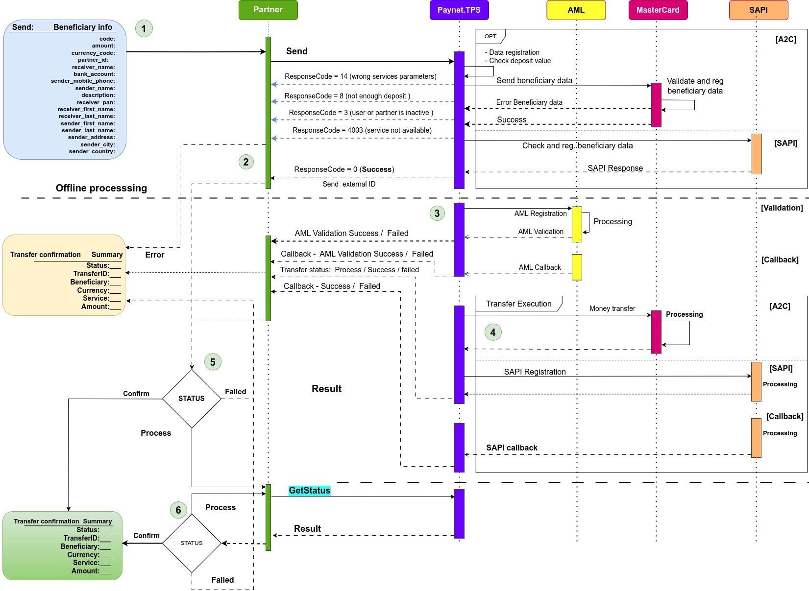

# 4. Базовый сценарий осуществления перевода

Каждый партнер может проводить переводы согласно конфигурации партнера и доступным для него сервисам перевода. Для получения списка доступных сервисов есть вспомогательные методы. 
Для совершения операции перевода необходимо получить список  параметров для осуществления перевода. Каждый перевод оперирует разными входными параметрами в зависимости от требований стороны сервиса получателя (провайдера).   
В роли провайдера выступает Mastercard.

## Базовый сценарий перевода:

1. Партнер делает запрос на регистрацию перевода. В запросе передается список полей, приведенных в разделе 7.1  (Таблица 2 - Параметры перевода ). Каждая операция перевода проводит проверку полей на корректность передаваемых данных . Также происходит проверка баланса партнера.  
Если валидация полей пройдена успешно и баланса партнера достаточно для совершения перевода (см. Clearing amount), то запрос принимается в обработку, данные отправляются провайдеру (Mastercard) и, после подтверждения провайдера, партнер получает подтверждение от системы, что запрос зарегистрирован и  принят в обработку (не все партнеры проводят проверку параметров на их стороне, в таком случае результат проверки будет предоставлен непосредственно в момент совершения операции).     

2. В ответе на запрос о регистрации перевода возвращается информация о переводе , которая содержит transfer_key (уникальный ключ-идентификатор со стороны системы, по которому партнер может получить текущее состояние перевода).  Состояние операции перевода партнер может получить по его уникальному ключу  который был передан при вызове метода API_REQUEST_ID.

3. Процесс обработки при необходимости может включать в себя  дополнительную стадию обработки, такую как автоматическая  проверка  бенефициара и отправителя  в службе AML (Anti-Money Laundering, противодействие отмыванию денег) . Перевод может быть осуществлен только при положительном результате проверки, при отрицательном  результате он будет отклонен.
Может возникнуть ситуация, требующая вмешательства специалиста по внутреннему контролю и соблюдению правовых норм, в компетенции которого подтвердить или отменить перевод, что может увеличить  время обработки перевода.

4. Происходит подтверждение внутренних статусов и взаимодействия с системой бенефициара для завершения операции перевода. 

5. В зависимости от результата операции, необходимо со стороны партнера   сделать запрос на получение статуса операции перевода, после этого  принимается  финальное решение по статусу перевода. 
Для  операций, которые требуют длительного времени обработки, система позволяет построить логику взаимодействия через  механизм нотификации (callback notification). Данный механизм в автоматическом режиме при смене статуса перевода в системе, отправит сообщение партнеру (сделает https вызов на стороне партнера и передаст информационный объект). 
При получении транзакцией статуса “success”, она считается успешной. 

6. Если перевод получил статус “process”, это означает, что он находился в обработке.  Для получения финального статуса  перевода  осуществляется запрос на получение статуса, который возвращает текущий статус перевода. Получение статуса операции перевода возможно как по ключу  операции перевода (transfer_key), так и по уникальному идентификатору со стороны партнера API_REQUEST_ID.
Перевод считается успешным при получении статуса  “success” . 

**Статусы перевода:**  

* Confirm  
* Process  
* Failed  

> Если транзакция оказалась не успешной, по какой-либо причине, то ей присваивается статус “failed”.  В этом случае сумма сlearing amount возвращается на баланс партнера. 

 

## Диаграмма

